# Oracle In-Memory: basics and beyond
### Priit Piipuu
### 13.11.2025

---

# Whoami: Priit Piipuu

Database performance engineer at FDJ United
Oracle Ace Pro
Member of Symposium 42
Blog: https://priitp.wordpress.com,
@ppiipuu.bsky.social

---
# What it's all about

* A gentle introduction to the in-memory analytics
* Oracle In-Memory basics
* What is under the hood?
* Other cool stuff

<!-- 
One reason for this presentation is now there's some buzz around in-memory analytics and
Apache Arrow in the free software world. At last, Oracle In-Memory might get competitiors.
-->
---

# Presentation and scripts available in Github


---

# Safe harbour statement

This presentation describes things as they are in Oracle 23ai
It is tested on Oracle 19c and 21c
You should always read the latest version of In-Memory docs, even if you're on older version

---

# What makes computation fast?

<!-- Find out what the CPU is doing and do it less.
CPU mostly waits for the caches to be filled
Cache-aware algorithms and programming styles give better performance. -->

---

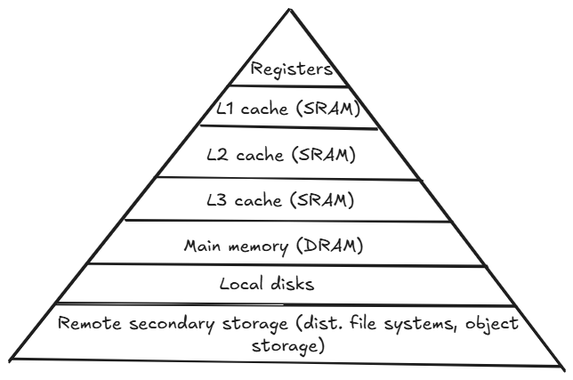
<!--
Adapted from Bryant & Hallaron, "Computer Systems: A Programmer's Perspective"
-->
---

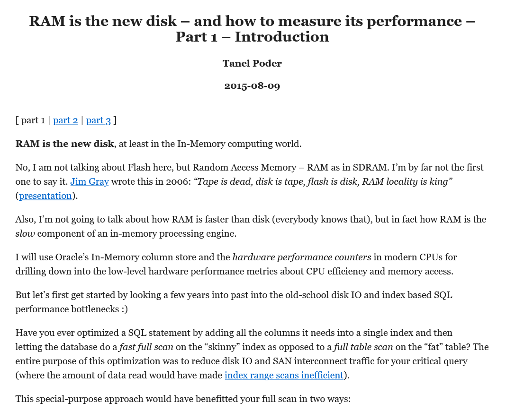

<!-- Tanel Põder, “RAM is the new disk” series: https://tanelpoder.com/2015/08/09/ram-is-the-new-disk-and-how-to-measure-its-performance-part-1/
-->

---
# Data-oriented design

Operates on arrays, this avoids call overhead and cache misses
Prefers arrays to structures, gives better cache usage
Inlines subroutines, avoids deep call hierarchies
Tight control on memory allocation

<!-- We’re mostly talking about the first point: arrays and other continuous memory regions. This gives better data locality and CPU cache hit ratio.

In context of data analytics, it is not a free lunch. More often than not, data has to be turned into CPU-friendly format and that takes an effort.
-->

---

# Simplified example

<!--
Examples are taken from "100 Go Mistakes and How to Avoid Them", by Teiva Harsanyi.
Chapter 12 has worked examples about cache effects on performance. It is a good book :)
-->
---

```go
type Foo struct {
        a uint64
        b uint64
}

foos := make([]Foo, size)
```

---

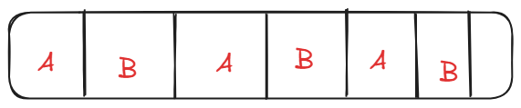

<!--
Memory layout is one continuous array, at least 2 structs per cache line.
-->
---

```go
type Bar struct {
        a []uint64
        b []uint64
}

 bars := Bar{}
 bars.a = make([]uint64, size)
 bars.b = make([]uint64, size)

```

---

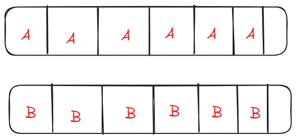

---

```go
type Baz struct {
        a    uint64
        b    uint64
        next *Baz
}

bz := make([]Baz, size)
for i = 0; i < size; i++ {
   bz[i] = Baz{i, i, nil}
   if i < size - 1 {
      bz[i].next = &bz[i+1]
   }
}
```

---


---

```bash
[pripii@pripii-roadkill loctest]$ go run .
Foos:    10000      104366 ns/op
Bar:    21056        57861 ns/op
Baz:     5560       213953 ns/op
```
---

# In case of Oracle In-Memory...

---


| Event | Full table scan | In-Memory scan | Difference |
|-------|-----------------|----------------|---|
| branch-instructions | 9700928898 | 716348559 | 13x |
| branch-misses | 123790427 | 30305893 | 4x |
| cache-misses | 33121710 | 4641178 |  7x |
| cycles | 31763298910 | 3322369500 | 9.6x |
| instructions | 65545341739 | 4178971681 | 15x |


> Source: https://priitp.wordpress.com/2024/10/16/does-oracle-in-memory-use-simd-instructions-joelkallmanday/

---

# Apache Arrow (I)

Framework and data interchange format
Language agnostic in-memory data structure specification
Metadata serialisation
Protocol for serialisation and generic data transport

<!-- Binary data format suitable for both in-memory processing and export. Avoids the overhead of serialization and deserialization: same format for in-memory processing, IPC/networking, and long-term storage. Shredding for the nested data: each location of structs or json documents gets its separate column.
-->

---
# Arrow columnar format

Data adjacency for sequential access
Constant time random access
Plays well with SIMD and vectorization
Zero-copy access
No compression

---
# Implementations

C/C++
Pyarrow (wrapper around the C/C++ library)
Pola.rs (written in Rust, adds SQL support and other cool features)
Dremio: query engine and data warehouse built around Arrow.

---

# Oracle In-memory and competitors
||Arrow implementations|Oracle In-Memory|
|---|---|---|
|Data types |Has own type system|Subset of SQL types|
|Access|Constant time random access|Through SQL queries|
|Transactional|No|Yes|
|Compute functions| Yes | In-Memory expr|
|Automatic parallelization|Yes|Yes|
|Automatic memory management|No/DYI|Yes|
|Automatic In-Memory|No|Yes|

---

# Oracle In-Memory
---
# Oracle In-Memory (I)
In-Memory column store (part of the SGA)
Query optimizations
Availability and automation
Integration with the Oracle features

---

# Oracle In-Memory (II)

On CDB/instance level:
   ```sql
   alter system set inmemory_size = 16G scope = spfile
   ``` 
On PDB level:
   ```sql
   alter system set inmemory_size = 8G scope = spfile;
   ```
<!-- 
PDBs can share the inmemory area configured on the CDB/instance level
It is possible to distribute inmemory area between the PDBs
-->
---

# Automatic In-Memory sizing in 23ai

Can automatically shrink or grow In-Memory area.
`inmemory_size` becomes minimum size for In-Memory
`INMEMORY_LEVEL` should be set to `MEDIUM` or `HIGH` 
ASMM manages In-Memory Area with other SGA components

<!-- 
In-Memory Area sizing can be either manual or automatic (in 23ai)
-->
---

# Oracle In-memory Base Level

Oracle EE feature
IM column store size less than 16GB per CDB or instance
Compression level is set to `QUERY LOW`
No Automatic In-Memory
```sql
alter system set inmemory_force = base_level scope = spfile;
```

<!--
Because of VECTOR GROUP BY it might be good to set inmemory_size > 0 even if you do not
populate any segments to in-memory area.
-->

---

# Populating the column store

During the population
*   Database reads row format data from the disk
*   Transforms into columnar format
*   Stores it in the IM column store

---

# Repopulation

Transforms *new* data into columnar format
Creates new IMCUs

<!--
IMCUs are read only, so new data is added to the transaction journal and new IMCUs are created during the repopulation.
-->
---

# `INMEMORY` attribute can be specified for

Tablespaces
Tables
Matrialized views
Set of columns

```sql
```
---

# `INMEMORY` attribute

Objects that can't be populated:
* Indexes
* Index-oriented tables
* Hash clusters
* Objects owned by SYS
* Objects in `SYSTEM` or `SYSAUX` tablespaces 

---

# Ineligible data types

Data types that can't be populated:
* Out-of-line columns like varrays, nested table columns 
* `LONG` or `LONG RAW` data types
* Extended data types

---

# Partitioned tables

In-Memory can be specified either on table level or partition level
Partitions inherit table-level clause
Works with hybrid partitioning, but results may vary

---

# External tables and external partitions

Some limitations:
* No subpartitions
* Column, distribute and priority clauses are not valid
* No join groups, In-Memory Optimized Arithmetic, In-Memory Expressions

---

# In-Memory and LOBs

Out-of-line LOBs can't be populated, IM column store saves only the locator


Inline LOBS:
* IM column store allocates 4KB of continuous buffer space
* For OSON data upper limit is 32KB

---

# In-Memory and queries

All referenced columns should be available in in-memory area
In Oracle 21c: columns can be read from disc during projection

---

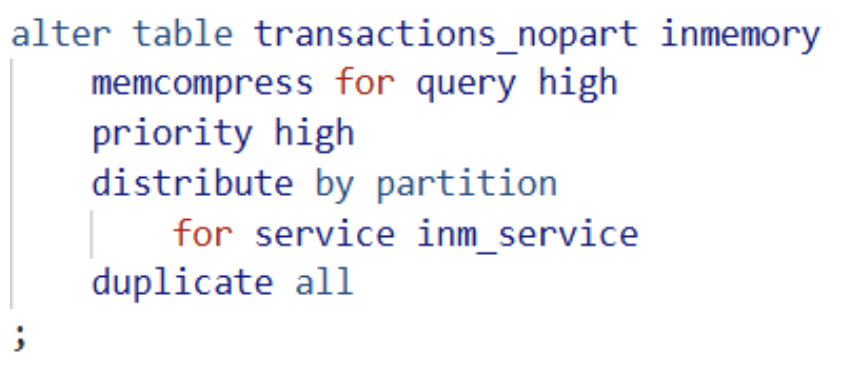

---

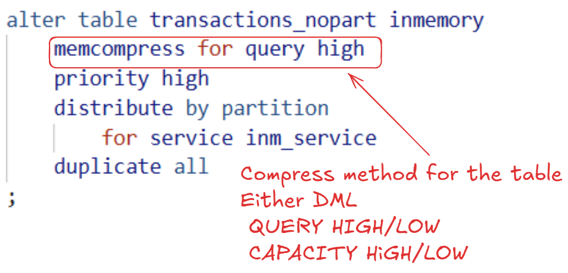

<!--

NO MEMCOMPRESS -> no compression.
MEMCOMPRESS AUTO -> database manages automatically eviction, recompression and population. New in 23ai.
MEMCOMPRESS FOR DML -> little or no compression, optimized for DML
QUERY LOW -> default level, should give best query performance
CAPACITY LOW -> according to documentation gives excellent query performance as well

-->

---

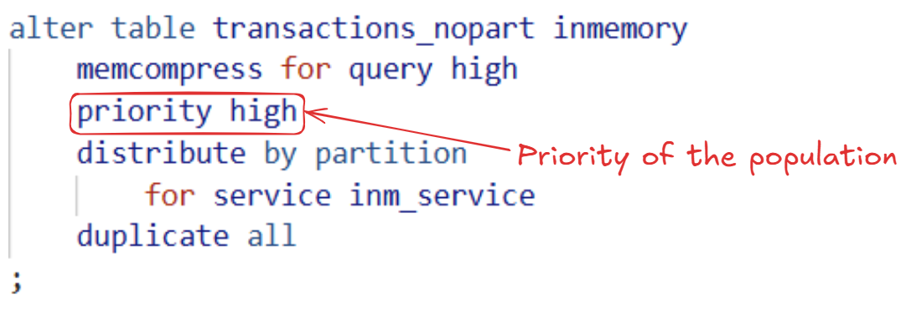

<!--
PRIORITY clause controls priority of the population and not speed.
NONE -> On-demand population, data will be populated only if table is accessed through full table scan. This is default.

With priority LOW .. CRITICAL data is populated through internally managed priority queue. Higer priority segments will get precedence over the lower precedence segments. In case of the lack of space, data is not populated until space is available.
-->

---

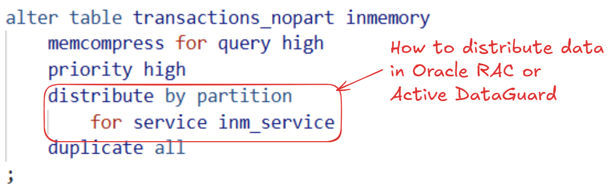

<!--
How data is distributed between RAC nodes:
AUTO -> larger tables are distributed according to the access patterns. Smaller tables as one chunk. (Default)
BY ROWID RANGE|PARTITION|SUBPARTITION -> Distribution by rowids, partitions or subpartitions.

Distribution for service:
DEFAULT -> Object is populated on all instances, except when PARALLEL_INSTANCE_GROUP is set.
ALL -> Object is distributed on all instances, even if PARALLEL_INSTANCE_GROUP is set.
service name -> Object is populated on instances where service is deployed.
NONE -> disables population.
-->
---


<!--
Controls how data is duplicated across the RAC instances.
NO DUPLICATE -> default
DUPLICATE -> data is duplicated on two instances.
DUPLICATE ALL -> data is duplicates on all instances.
-->

---

# Under the Hood

---

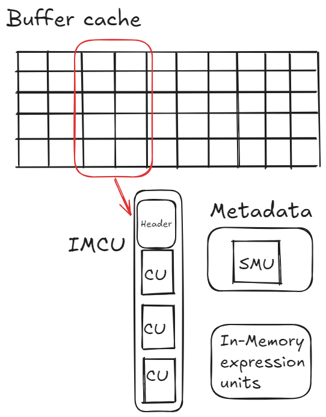

<!--
In-Memory compression unit (IMCU) contains Compression Units with the column data (from
one or more columns), and the header. IMCU header contains various metadata, and might
contain IM storage index. IMCU stores data from one and only object. IMCU includes all
the columns from the table.

Columns in IMCU are not sorted, IMCUs are populated in the order data is read from the
disk. IMCU allocates space in contiguous 1M pieces (extents)

Column Compression Units (CU) is continuous storage for a single column. CU has a body
and a header. Header contains metadata about the values stored in CU (min and max values
stored). It may contain local dictionary (for dictionary encoding?) The CU stores values
in ROWID order.

IMCU contains ROWIDs as well, this is how column values are stitched together. (In case
of join group, local dictionaries contain references to the common dictionary) 

Snapsot Metadata Unit contains metadata for associated IMCU (1:1). Contains object
numbers, column numbers, mapping info for columns and transaction journal. When row
in the buffer cache changes, then database adds modified row(id?) to the SMU and marks
it stale as of SCN. Recent versions will come from buffer cache.

-->
---

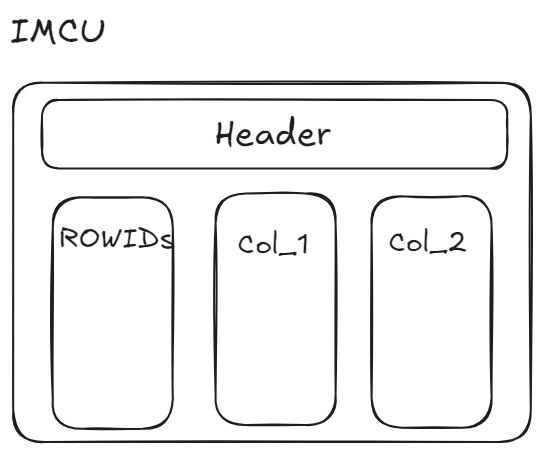

<!--
In-Memory compression unit (IMCU) contains Compression Units with the column data
(from one or more columns), and the header. IMCU header contains various metadata,
and might contain IM storage index. IMCU stores data from one and only object. IMCU
includes all the columns from the table.

Columns in IMCU are not sorted, IMCUs are populated in the order data is read from the
disk. IMCU allocates space in contiguous 1M pieces (extents)

Column Compression Units (CU) is continuous storage for a single column. CU has a body
and a header. Header contains metadata about the values stored in CU (min and max values
stored). It may contain local dictionary (for dictionary encoding?) The CU stores values
in ROWID order. IMCU contains ROWIDs as well, this is how column values are stitched
together. (In case of join group, local dictionaries contain references to the common
dictionary) 

-->
---

# Snapshot metadata units
Every IMCU has a separate SMU
SMU contains metadata for IMCU (Object and column numbers, mapping for rows)
SMU contains transaction journal

---

# Transaction journal
Keeps IMCU transactionally consistent
In case of a change database adds rowid to the journal and marks it stale as of SCN
Stale rows are read from buffer cache

---

# In-Memory expression units
Stores materialized In-Memory expressions and virtual columns
Logical extension of the parent IMCU
Maps to the same rowset as IMCU

---

# Expression statistics store
* Maintained by the optimizer, stores statistics about expression evaluation
* Part of the data dictionary, used for IM expressions
* Exposed as DBA_EXPRESSION_STATISTICS view

---

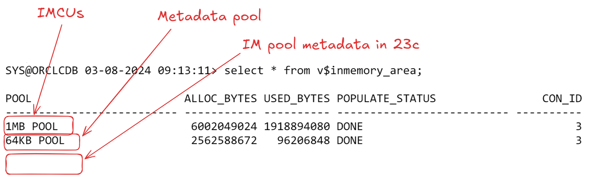

<!-- 
Screenshot is from 21.13
Columnar data pool (IMCUs), 1MB pool in V$INMEMORY_AREA
Metadata pool, 64KB pool in V$INMEMORY_AREA
“IM pool metadata”, IM POOL METADATA in V$INMEMORY_AREA
“Metadata pool” stores metadata about the objects that reside in the Im column store. “IM pool metadata” stores other metadata which can’t be stored in metadata pool.

-->
---

# In-Memory store population and repopulation
Happens magically
Tasks are coordinated by In-Memory Coordination Process (IMCO)
Actual work is done by Space Management Worker Processes (Wnnn)

---

# In-Memory store population
IMCO triggers population of all segments with priority higher than NONE
Segments with priority NONE are populated after they’re scanned
Workers create IMCUs, SMUs, and IMEUs

<!-- 
IMCO wakes up
Checks if repopulation od IMCUs is needed
Triggers Wnnn to do the work
SMCO sleeps for 2 minutes

-->

---
# In-Memory store repopulation (I)
Thresold-based, triggered when # of stale entries in IMCU reaches the threshold
Thresold is percentage of entries in transaction journal
Double buffering: new IMCU is created by combining old IMCUs with transaction journals

<!-- 
During repopulation, old IMCUs remain accessible. IMEUs can be added later, without repopulating the IMCU
-->
---
# In-Memory store repopulation (II)
`INMEMORY_MAX_POPULATE_SERVERS` -> max number of workers
`INMEMORY_TRICKLE_REPOPULATE_PERCENT` -> max percent of time workers can do trickle repopulation

---
# In-Memory dynamic scans (I)
Uses threads to scan the IMCUs
Uses idle CPU

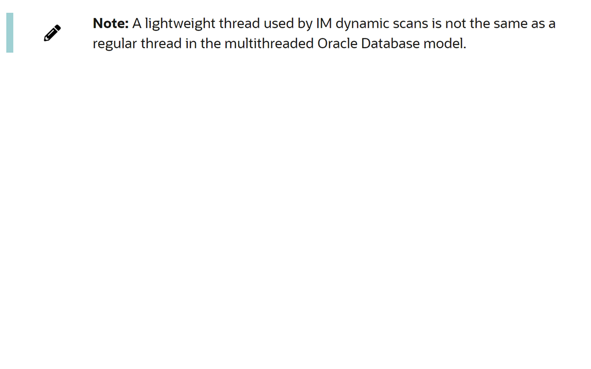

---
# In-Memory dynamic scans (II)

Enabled when a CPU resource plan is enabled and CPU utilization is low
`CPU_COUNT` must be `>= 24`

Query is candidate for dynamic scan if 
   * It access high number of IMCUs or columns
   * Consumes all rows in the table
   * Is CPU intensive

---

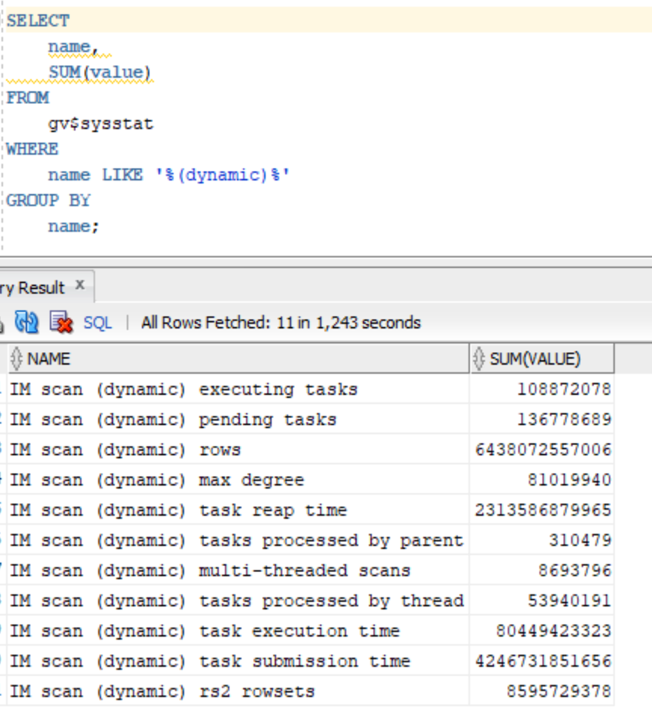

<!-- 
Screenshot is from 19c RAC.
-->
---

# In-Memory joins (I)

IMCUs encoded with different dictionaries have to be decoded to be joinable
In-Memory join groups encode different tables with the same dictionary
Eliminates need for decompressing and hashing column values
External tables not supported!

<!-- 

In-Memory joins can be optimized through Bloom filters. If the Bloom filter isn't appropriate, columns need to be decomressed for the hash join. Join groups eliminate the
need for the decompression and hashing.

TABLE ACCESS IN MEMORY FULL operation in the query plan means that between zero and all the data is read from the IM column store.
-->

---

# In-Memory joins (II)

```
create inmemory join group cust_trans_jg ( customers ( id ),transactions ( customer_id) );
```
Common dictionary is build next time table is (re)populated


---

# In-Memory joins (III)

```
INMTEST> column joingroup_name format A30
INMTEST> column column_name format A64
INMTEST> select joingroup_name, table_owner || '.' || table_name || '.' || column_name as column_name, flags, gd_address from user_joingroups;

JOINGROUP_NAME                 COLUMN_NAME                                                           FLAGS GD_ADDRESS
------------------------------ ---------------------------------------------------------------- ---------- ----------------
CUST_TRANS_JG                  INMTEST.CUSTOMERS.ID                                                      1 000000043FCFFF20
CUST_TRANS_JG                  INMTEST.TRANSACTIONS.CUSTOMER_ID                                          1 000000043FCFFF20

```

---

# In-Memory joins (IV)

Usage is hidden really well
Easiest to spot in the SQL Monitoring Report

---

# In-Memory and aggregation

Uses arrays for joins and aggregation
Cost-based, used for `GROUP BY`
Does not support `GROUP BY ROLLUP`, `GROUPING SETS` and `CUBE` 
Main benefit: allows vector joins and group by operations while scanning the fact table

---

# KEY VECTOR and VECTOR GROUP BY (I)

`INMEMORY_SIZE` must be set to non-zero value
Tables do not have to be populated to the IM store (!)
Transforms join between dimension and fact table into a filter
Key vectors are conceptually similar to the Bloom filters

---

# KEY VECTOR and VECTOR GROUP BY: some limitations

Does not benefit joins between large tables
Dimension has more than 2bn rows

---

# KEY VECTOR and VECTOR GROUP BY: some conditions

Query joins the fact table with one or more dimensions
Multiple fact tables joined by same dimension also supported

---

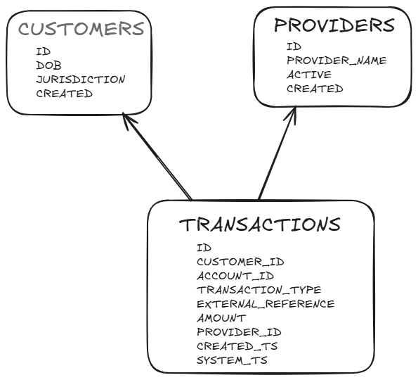

---

```sql
select c.jurisdiction,
       p.provider_name,
       sum(t.amount)
  from transactions t
  join customers c
on t.customer_id = c.id
  join providers p
on p.id = t.provider_id
 group by c.jurisdiction,
          p.provider_name;
```

---

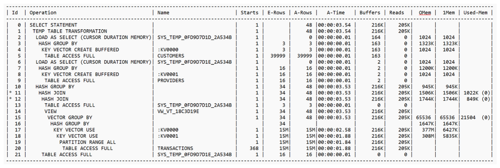

---

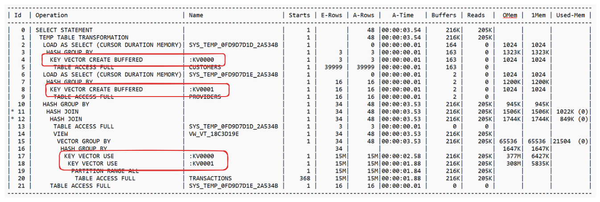

---
# Compression

Levels from FOR DML to FOR CAPACITY HIGH
FOR QUERY handles NUMBERs

<!-- 
Oracle NUMBER data type is a composite data type and thus not especially CPU friendly. FOR QUERY and better compression levels transform it to something more computable.

FOR QUERY LOW seems to be using dictionary encoding only, FOR CAPACITY HIGH uses Zstandard.

-->
---

# It happens all in runtime

Does TABLE ACCESS IN MEMORY FULL access path mean data comes from the In-Memory?

<!-- 
Data might be stale. Segments might not be loaded into In-memory, for example in RAC. Or your query might mix and match columns that are not loaded into In-memory: in that case data will come from the buffer cache. And query optimizer is totally oblivious about what decision are taken during the scan.
-->
---

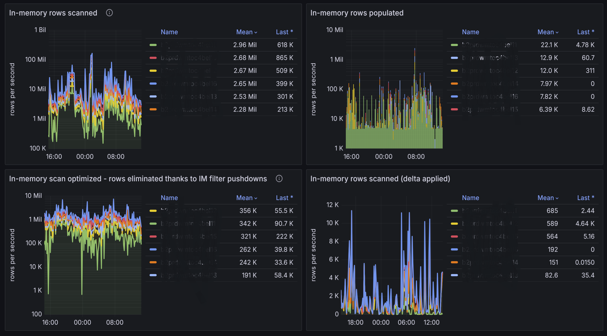

---

# In-Memory expressions

Precompute and store computationally expensive expressions
Created automatically by the database
Database tracks most active expressions in the capture window

---

# In-Memory virtual columns

Created by the user
Populated by the IM expressions infrastructure

<!--
Difference between the In-Memory expressions and virtual columns is that expressions are hidden from the user while IM virtual columns are visible.
-->

---

# IM expression capture

`DBMS_INMEMORY_ADMIN.IME_CAPTURE_EXPRESSIONS`  identifies 20 hottest expressions in the time range
Possible time intervals:
* `CUMULATIVE` -- all expressions since the creation of the database
* `CURRENT` -- expressions from the past 24h
* `WINDOW` -- expressions from the last capture window

<!--
`WINDOW` is the user-defined interval.
-->

---

# IM expression capture (II)

Captured expressions will become hidden `SYS_IME` columns
Old expressions will be markes with `NO INMEMORY` attribute
Table can have max 50 `SYS_IME` columns
To allow new columns, old columns must be dropped

<!--
Dtabase queries ESS, and considers only expressions on heap-organized tables that are at least partially populated to IM store.

IME columns can be dropped either with `DBMS_INMEMORY.IME_DROP_EXPRESSIONS` or
`DBMS_INMEMORY_ADMIN.IME_DROP_ALL_EXPRESSIONS` procedures.

`IME_POPULATE_ESPRESSIONS` poulates the expressions. Otherwise expressions are populated when
-->

---

# IM expression capture (III)

Expressions are populated
* When `DBMS_INMEMORY_ADMIN.IME_POPULATE_EXPRESSIONS` is called
* When parent IMCUs are (re)populated

---

# In-Memory optimized dates

Set the `INMEMORY_OPTIMIZED_DATE` to `ENABLE`
`DATE` fields will be populated with `MONTH` and `YEAR` IM expressions
Speeds up `EXTRACT` function
Available in Oracle 23ai

---

# In-Memory and JSON

Useful for queries that scan large number of small JSON documents
Supports full-text search for `JSON` data type
Speeds up SQL/JSON path access
JSON data in IM column store is stored as OSON

<!--
Storing JSON in IM column store is more complicated than that. See for example table 7-1 here:
https://docs.oracle.com/en/database/oracle/oracle-database/23/inmem/optimizing-in-memory-expressions.html
-->
---

# In-Memory and JSON: limitations

Limitation: documents should be smaller than 32k
Parameter `max_string_size` should be set to `extended`

<!--
If the document is larger than 32k, query accesses the row store.
`max_string_size` requirement affects JSON persisted in VARCHAR2, CLOB and BLOB columns. This does not affect(?) JSON data type.
-->

---

# In-Memory and JSON: initialization parameters

`INMEMORY_EXPRESSIONS_USAGE` -> `STATIC_ONLY` or `ENABLE`
`INMEMORY_VIRTUAL_COLUMNS` -> `ENABLE`

<!--
`INMEMORY_EXPRESSION_USAGE = ENABLE` allows materialization of dynamic expression, `INMEMORY_VIRTUAL_COLUMNS = ENABLE` allows population of all virtual columns. 
-->

---

---

# Thank you!